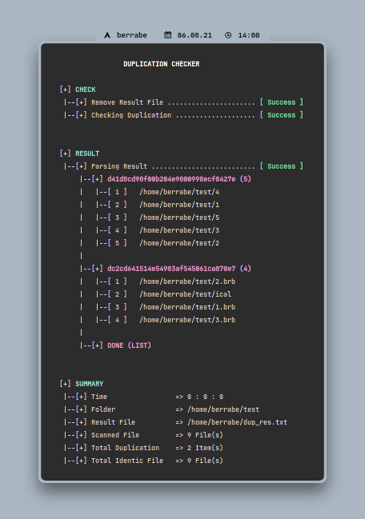

<p align="center">
  
</p>

<br/><br/>


### 1 - INTRO
---
this script was made just for fun during my free time, but maybe this can help solve problems related to file duplication.

this script is very simple, where it will scan a folder using find (you can use regex), then it will hash using the md5 algorithm and compare all existing records
some logic using xargs so work can be fast, thanks to multiprocessing!!

<br/><br/>


### 2 - SETUP
---
- just, download

```sh
> wget https://raw.githubusercontent.com/berrabe/file-duplication-checker/master/duplication_checker.sh
> chmod +x duplication_checker.sh
```

<br/><br/>


### 3 - USAGE
---
- Keep It Simple S***** .... just run wth 1 arg (the folder you want to scan), just like that

```sh
> ./duplication_checker.sh $HOME/test
```

<br/>

- and the output will be like this

<p align="center">
  
</p>


<br/><br/>